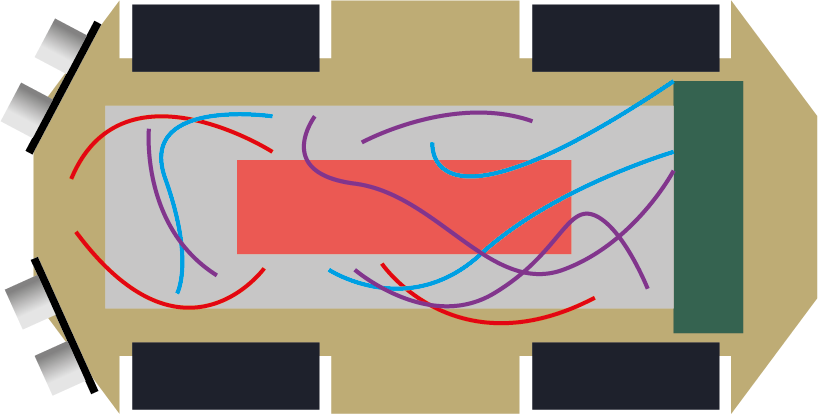

# MCU Basics through an RC Car

**Project Date:** June 2021

This project demonstrates the basic operation of a microcontroller using an **ATmega128**.
Instead of using Arduino libraries, it directly controls the hardware by setting registers, timers, and interrupts.
The goal is to understand how these components work together in a simple obstacle-avoiding RC car.

---

## Hardware Setup

| Component   | Description                           |
| ----------- | ------------------------------------- |
| **MCU**     | ATmega128 (16 MHz clock)              |
| **Sensors** | Two ultrasonic sensors (Left & Right) |
| **Motors**  | Two DC motors (Left & Right wheels)   |
| **Display** | 16×2 LCD (shows position)             |
| **Power**   | 5V logic and separate motor supply    |

---

### Ultrasonic Distance Measurement (Timer + Interrupts)

Each ultrasonic sensor sends a short **10 µs trigger pulse** and waits for the **Echo signal** to return.
The MCU measures how long the Echo pin stays **HIGH**, which represents the **round-trip time** of the sound wave.

#### Timer Configuration

* **System clock:** 16 MHz
* **Prescaler:** 8 → each timer tick = 0.5 µs
* **Counting range:** 140–255 → `(256 − 140) × 0.5 µs = 58 µs` per overflow
* Each overflow triggers an interrupt (`ISR(TIMERx_OVF_vect)`) that increments `pulse_count`

The total echo time is:
`echo_time = pulse_count × 58 µs`

Since sound travels about **340 m/s**, the distance in centimeters is:
`distance (cm) = echo_time / 58 ≈ pulse_count`

Each overflow roughly represents **1 cm** of distance.

#### Interrupt Operation

Interrupts handle all time-critical tasks, allowing the MCU to measure distance
while the main loop continues controlling motors and updating the display.

| Event             | Action                            | Interrupt                        |
| ----------------- | --------------------------------- | -------------------------------- |
| Echo rising edge  | Start timer                       | External (INT4 / INT5)           |
| Echo falling edge | Stop timer and calculate distance | External (INT4 / INT5)           |
| Timer overflow    | Increment `pulse_count`           | Timer Overflow (TIMER0 / TIMER2) |

This enables precise, non-blocking distance measurement in real time.

---

### Motor Control

Motors are controlled through **PORTF** and **PORTB**.
Each output bit sets the rotation direction via a motor driver circuit.

Based on sensor readings:

* No obstacle → move forward
* Obstacle on right → turn left
* Obstacle on left → turn right
* Obstacles on both sides → stop

All control is done at the **register level**, ensuring direct and immediate hardware response.
